# House Sample

[](https://github.com/filiptomanec/house-sample/actions/workflows/ci.yml)

**One data model for a fictional house. It drives the floor plan, the 3D model, the sun, energy and budget calculations, and the renders.**

[Live site](https://house-sample.vercel.app) (Czech) · [English version](https://house-sample.vercel.app/en) · [Documentation](docs/README.md)

<p align="center">
  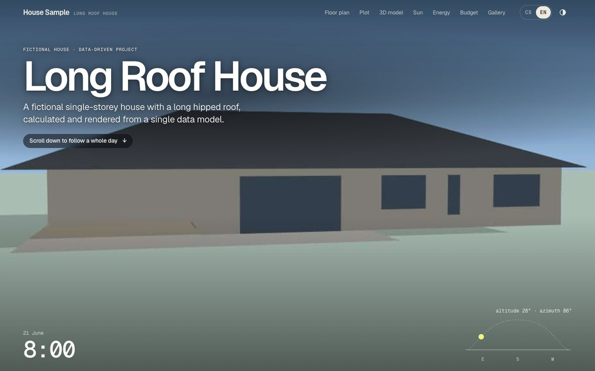
</p>

House Sample is a portfolio project about "Long Roof House", a **fictional** single-storey house on a **fictional** plot. Everything
the site shows about it is computed from the files in [`model/`](model): areas, U-values, hours of direct sun, PV yield, quantities
and prices, the floor plan, the interactive 3D scene, the STL for printing, and the rendered pictures. Nothing is typed into a
page by hand, and the house and the plot are invented (the only real anchor is the region, South Moravia, with coordinates rounded to 0.1°).

I built it to show end-to-end engineering on one coherent problem: a typed data model and kernel, numerical code with independent
tests, a procedural Blender pipeline, a performance-conscious three.js scene, a bilingual Next.js site that works well on an
iPhone, and the build and privacy checks that keep a public repository clean.

## What the site does

| Page | What you can do |
|---|---|
| **Home** | Scroll through a whole day (render frames and a live sun arc), around the house, and drag a slider that compares two hours; the numbers on the page come from the model. |
| **Floor plan** | Rooms, openings and dimensions drawn from the model; zones, measuring, an interactive furniture layer ("My furniture"), room cards with area, volume, glazing and construction. |
| **Plot** | The invented plot: boundary, set-backs, terrain with contours and a section, access, planting, and the rules the placement is checked against. |
| **3D model** | Orbit, walk through the house (keyboard, drag or joystick), cut the roof away or section it at any height, switch layers (roof, furniture, blinds), try facade, timber and roof looks, move the sun. **Exports:** STL for 3D printing at 1:100 to 1:200 with a bed-fit check, USDZ for AR Quick Look on iPhone, the light GLB. |
| **Sun** | Pick any day and hour: sun path, shadows from the house, neighbours, trees and terrain (ray casting with leaf-dependent transmittance), hours of direct sun per room and on the terrace, the effect of slat screens and blinds. |
| **Energy** | Heat demand (EN ISO 13790 monthly method), heat pump, hot water, household and EV electricity; PV production per roof plane from [PVGIS](https://joint-research-centre.ec.europa.eu/photovoltaic-geographical-information-system-pvgis_en) data, hourly self-consumption with a battery, payback. Adjustable inputs, a roof plan where you switch planes and panels on and off. |
| **Budget** | Bill of quantities measured from the geometry, a unit-price book, reserve and VAT classes, editable lines with reset, a cost range check, materials cards, CSV export. |
| **Gallery** | Cycles renders at different hours of the day, filters, a lightbox and an orbit video. |

Czech is served on the root URLs and English under `/en`, with localised routes and Czech typography (non-breaking spaces).
Light and dark schemes follow the system or the switch. Phones are a first-class target: complete server-rendered HTML,
a light 3D model, render-on-demand, context-loss recovery and 44 px touch targets (see *Key decisions*).

<table>
  <tr>
    <td>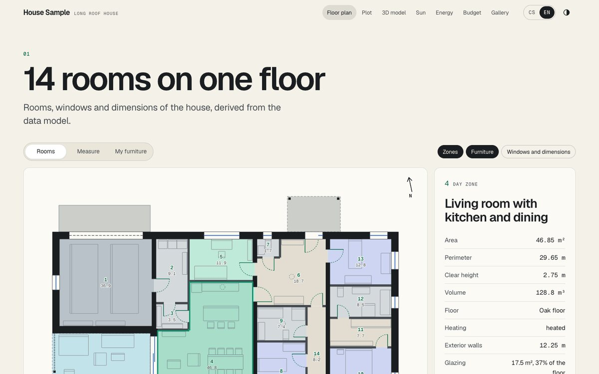<br><sub>Floor plan (light)</sub></td>
    <td>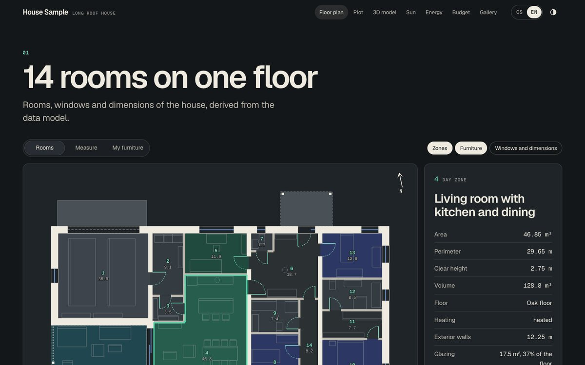<br><sub>Floor plan (dark)</sub></td>
  </tr>
  <tr>
    <td>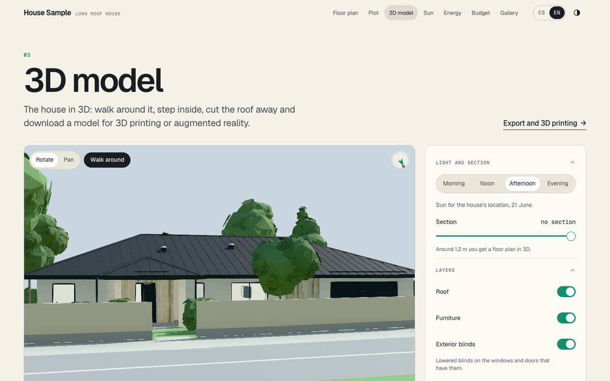<br><sub>3D model (light)</sub></td>
    <td>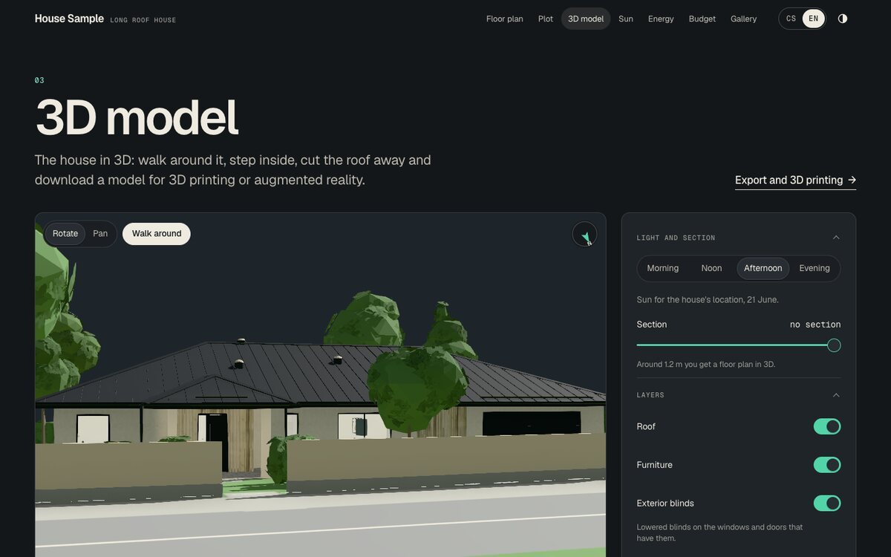<br><sub>3D model (dark)</sub></td>
  </tr>
  <tr>
    <td>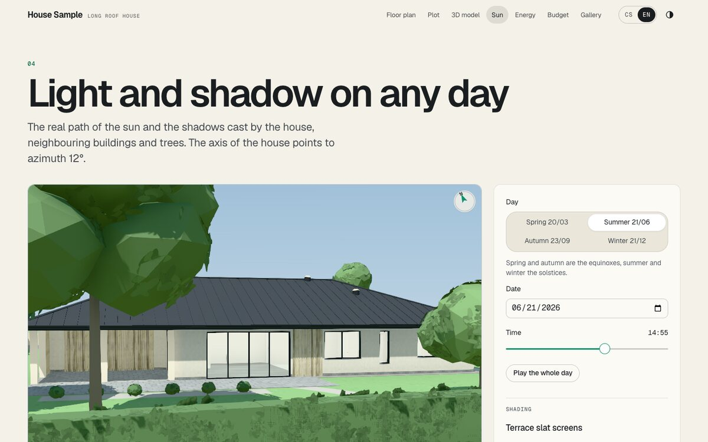<br><sub>Sun</sub></td>
    <td>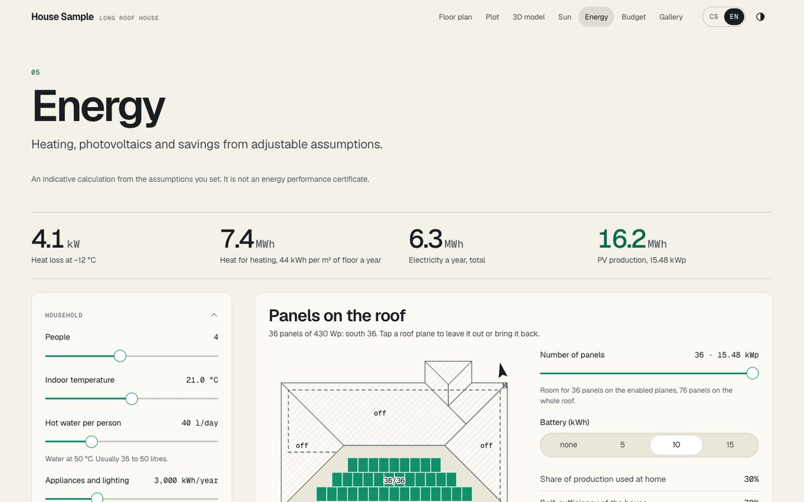<br><sub>Energy</sub></td>
  </tr>
  <tr>
    <td colspan="2">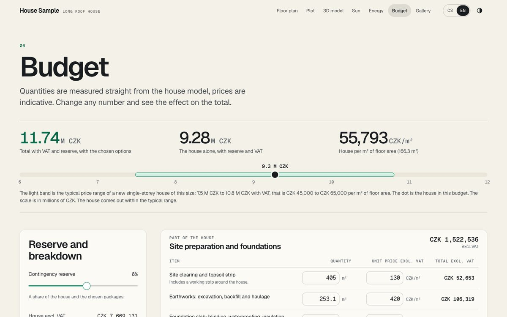<br><sub>Budget</sub></td>
  </tr>
</table>

<table>
  <tr>
    <td>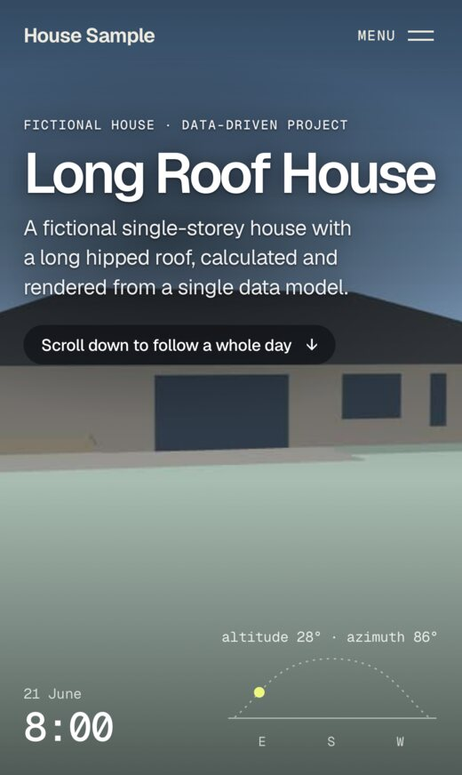</td>
    <td>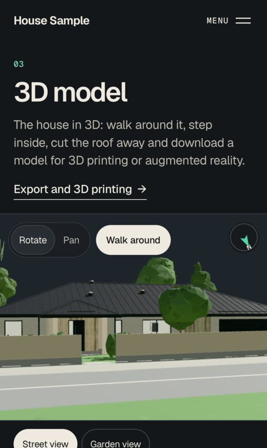</td>
    <td>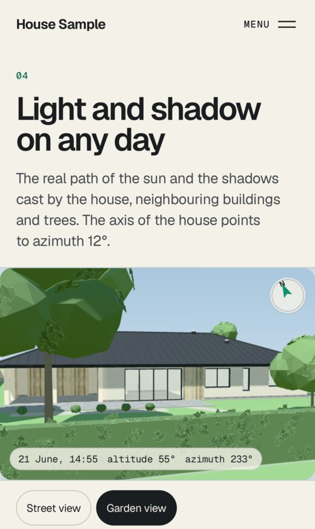</td>
    <td>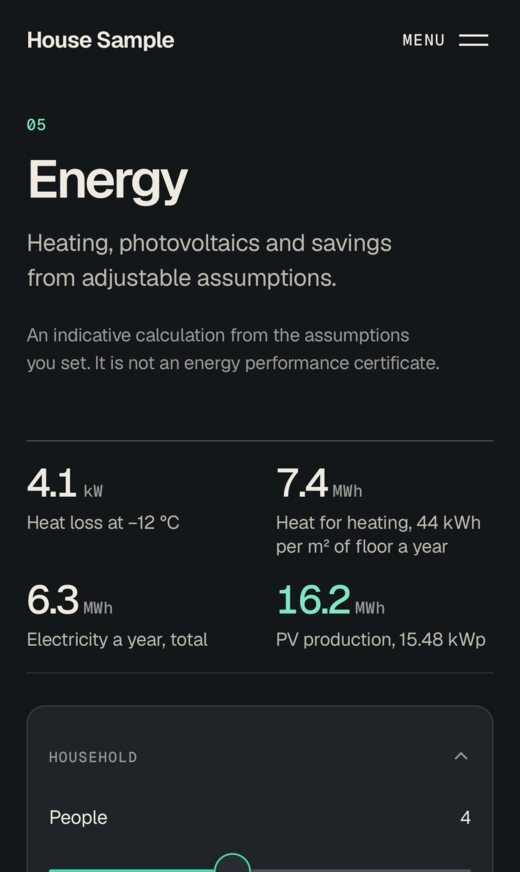</td>
  </tr>
  <tr><td colspan="4"><sub>iPhone 15 (WebKit): home, 3D model, sun, energy. The screenshots are made by <code>npm run readme:shots</code>.</sub></td></tr>
</table>

## Architecture

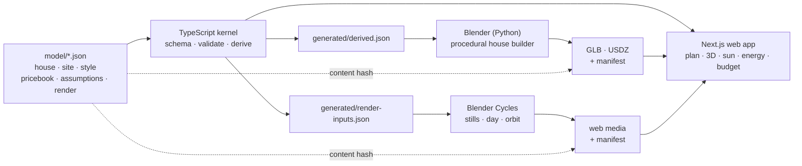

* **`model/*.json`** is the only place a number about the house lives. A zod schema defines it; [`docs/HOUSE-FORMAT.md`](docs/HOUSE-FORMAT.md) explains it.
* **The kernel** (`src/lib/model`, pure TypeScript) validates the model and derives everything geometric once: net room polygons, walls, openings with true facing, roof faces with eave, ridge and hip edges, PV layout, plot analysis. The calculations (`src/lib/calc`) and the 3D engine (`src/lib/three`) are built on it.
* **The pipeline** (`pipeline/`, Blender's Python) never derives geometry itself. It reads `generated/derived.json` and builds the house procedurally; a second script renders from `generated/render-inputs.json`. Outputs are GLB and USDZ files and web media with manifests.
* **The web app** reads the same kernel output, so the plan, the 3D scene, the sun, the energy figures and the pictures cannot disagree.

Details: [`docs/ARCHITECTURE.md`](docs/ARCHITECTURE.md), [`docs/KERNEL-API.md`](docs/KERNEL-API.md), [`docs/CALC-API.md`](docs/CALC-API.md), [`docs/THREE-API.md`](docs/THREE-API.md), [`docs/PIPELINE.md`](docs/PIPELINE.md).

## The data

A shortened excerpt of [`model/house.json`](model/house.json) (schema `house/1`; plan coordinates are metres in the house frame, x east, y north):

```jsonc
{
  "schema": "house/1",
  "id": "long-roof",
  "name": { "cs": "Dům Dlouhá střecha", "en": "Long Roof House" },
  "fictional": true,
  "location": { /* region, coordinates rounded to 0.1°, time zone */ "houseAxisBearingDeg": 12 },
  "wall": { "ext": 0.5, "bearing": 0.3, "part": 0.15 },
  "clearHeight": 2.75,
  "rooms": [
    { "id": "R01", "name": { "cs": "Garáž pro dvě auta", "en": "Two-car garage" },
      "type": "garage", "role": "garage", "floor": "concrete", "rects": [[0, 5.4, 6.65, 11.8]] }
    // ...
  ],
  "openings": [
    { "id": "S01", "kind": "slider", "orient": "h", "cx": 10.2, "cy": 0, "w": 4.4, "sill": 0, "head": 2.4 }
    // ...
  ],
  "roofs": [{ "id": "T1", "rect": [-0.25, -0.25, 23.25, 12.05], "pitch": 22, "overhang": 0.8, "wallTop": 3.05 }],
  "equipment": { "pv": { "module": { "wp": 430 /* ... */ }, "layout": { "facings": ["S"], "gap": 0.02 /* ... */ } } }
}
```

The model stores only what a designer would decide: rectangles between wall axes, openings by position and size, roofs by outline and pitch.
Everything else is derived. For the opening above, the kernel adds the wall it sits in, that it is exterior, its true azimuth (192°, because the house axis is
rotated 12°), its glazed area, and the roof overhang above it, which the sun and energy calculations then use:

```jsonc
// generated/derived.json (excerpt)
{ "id": "S01", "wallId": "Z01", "exterior": true, "azimuthTrue": 192, "facing": "S", "glazingArea": 10.56, "blind": true,
  "overhang": { "depth": 0.8, "eaveHeight": 2.72678, "wallTop": 3.05 } }
```

## Key technical decisions

| Decision | Why |
|---|---|
| **One source of truth.** Every page, calculation and render reads `model/*.json`; no house number appears in JSX or Python, and code never branches on an id. | A plan, a 3D model, a cost estimate and a render of the same house cannot drift apart. Changing the roof pitch changes all of them. |
| **Derive once in TypeScript, consume everywhere.** The kernel is pure and deterministic; Blender reads `generated/derived.json` instead of re-deriving. | Geometry is implemented and tested once (invariants plus an independent oracle). There is no second implementation in Python to keep in step. |
| **A GLB contract with `extras`.** Every mesh carries `{ role, toggle?, id? }` and one material per role; the contract is tested against the committed files. | The web can switch the roof by node, recolour a role (facade "looks") without new textures, and join a mesh to the model by id without branching on it. |
| **Render inputs.** Cameras, sun positions, terrain, vegetation and equipment go to the render scripts as one JSON file. | Renders and the web agree on the sun and the ground; the render scripts contain no geometry or astronomy. |
| **Tiers for phones.** A lite GLB of about 0.3 MB (2.2 MB for desktop), render on demand, MSAA instead of post-processing, capped pixel ratio, merged furniture draw calls, a Draco decoder that is released when idle, three.js on two routes only. | iPhones have little memory and few GL contexts. The page shell paints before three.js arrives; WebGL loss and load failures are values with a retry, never a blank canvas. |
| **Determinism and a content hash.** Builds are byte-identical for the same inputs; the SHA-256 of the model is stored in the derived data and in both manifests; asset URLs carry it. | CI fails when a committed GLB or media file is stale, and assets can be cached immutably. |
| **Calculations as pure functions with stable keys.** Roof planes are keyed by geometry (`S192.22@0,-10`), not by order or id; visitor inputs pass through `sanitize*` functions; no function reads the clock or a random number. | Saved choices survive model changes safely or are dropped, server and client markup agree, and garbage input cannot produce `NaN`. |
| **Invariants and oracles instead of golden numbers.** Tests check that areas add up, openings lie on walls, rooms are reachable, panels sit inside roof planes, and compare numeric code with another route to the same number. | The tests survive a change of the house and fail for real mistakes. |
| **Validators stay out of the browser.** The zod schemas of the price book and the assumptions live in their own files; a test pins that parsing the JSON changes nothing. | About 100 KB less JavaScript on the Energy and Budget pages. |
| **A local privacy gate.** A scanner checks the tree, history, build output and the metadata of images, models and videos against a denylist kept outside the repository, plus generic detectors; git hooks and CI run it. | A public repository about an invented house must not leak anything about a real one. See [`docs/PRIVACY.md`](docs/PRIVACY.md). |

## Run it

Node 22 or newer.

```bash
npm install
npm run dev            # http://localhost:3400

npm run typecheck      # TypeScript
npm run lint           # ESLint
npm test               # Vitest: unit tests of the kernel, calculations, 3D engine, pages and scripts
npm run build          # production build
npm run check:bundles  # after a build: three.js only on the Model and Sun pages, no external hosts, size per page
npm run e2e            # Playwright against a production build (install the browsers first: npx playwright install chromium webkit)
npm run privacy        # the privacy scan with its generic detectors
npm run verify         # typecheck, lint, tests, build and the bundle check in one go

npm run model:validate # validate model/house.json with a readable report
npm run model:build    # rewrite generated/derived.json after changing the model
npm run check:model    # fail when generated/derived.json is stale
npm run readme:shots   # regenerate docs/img (the site must be running; needs ImageMagick)
```

**Blender pipeline (optional).** The committed models and media are enough to run the site. To rebuild them you need Blender 5.1 and a local cache of
the CC0 textures listed in [`ASSETS.md`](ASSETS.md):

```bash
npm run models                                   # house.glb, house-lite.glb, house.usdz, verification, manifest
npx tsx scripts/build-render-inputs.ts           # generated/render-inputs.json for the renders
# renders: Blender -b --python pipeline/render/photo.py -- --mode stills|day|orbit   (docs/RENDER-INPUTS.md)
bash scripts/build-media.sh                      # renders -> public/media and manifest (ImageMagick, ffmpeg)
```

## Quality

* **Tests.** More than 1,500 unit tests in about 90 files: kernel invariants and an independent oracle, the calculations, the 3D engine (without a GL context), page logic, the build scripts and the privacy scanner. Playwright end-to-end tests run on desktop Chromium, iPhone 15 and iPhone SE (WebKit) and a Pixel 7.
* **CI** ([`.github/workflows/ci.yml`](.github/workflows/ci.yml)): typecheck, lint, tests, freshness of the derived data and of the GLB manifest, build, bundle gate, privacy scan, then the e2e suite.
* **Bundle gate.** `scripts/check-bundles.mjs` reads the built pages and fails when three.js reaches any page other than Model and Sun, when a page loads an external script, style or font, and reports the size per page.
* **Privacy scan.** `scripts/privacy/scan.mjs` checks the working tree, the git history, the build output and the metadata of media, locally in hooks and in CI.
* **Accessibility and design.** Colour tokens are tested for WCAG 2.2 contrast in both schemes, touch targets are 44 px, motion honours `prefers-reduced-motion`, the 3D canvas has a name and a keyboard model ([`docs/DESIGN.md`](docs/DESIGN.md)).
* **Size.** About 53,000 lines of TypeScript (tests and scripts included) and 11,500 lines of Python.

## Limitations

* The house, the plot and the prices are invented; the location is only a region with coordinates rounded to 0.1°. The price book holds generic Czech price levels of 2026 and gives a range, not a quote.
* The energy figures are an **indicative** monthly calculation (no cooling or summer overheating, no night set-back, typical days, a simple battery model, no price growth). It is not an energy performance certificate and not a design. The sources and simplifications are listed on the page and in [`docs/ENERGY-ASSUMPTIONS.md`](docs/ENERGY-ASSUMPTIONS.md).
* The structure, the details and the building services are not designed; the model is a massing and planning model with construction layers.
* AR works in Safari on iPhone and iPad (Quick Look); other browsers download the file. The 3D pages need WebGL 2.
* The renders are stills and a video, not a live path tracer. Rebuilding the models and renders needs Blender 5.1 and the CC0 asset cache, which is not committed.

## Documentation

[`docs/README.md`](docs/README.md) is the index. The most useful starting points:
[`ARCHITECTURE.md`](docs/ARCHITECTURE.md) (conventions and contracts),
[`HOUSE-FORMAT.md`](docs/HOUSE-FORMAT.md) (the data model),
[`KERNEL-API.md`](docs/KERNEL-API.md), [`CALC-API.md`](docs/CALC-API.md), [`THREE-API.md`](docs/THREE-API.md) (the code APIs),
[`PIPELINE.md`](docs/PIPELINE.md) (Blender),
[`DESIGN.md`](docs/DESIGN.md) (design system),
[`PRIVACY.md`](docs/PRIVACY.md) (privacy checks).

## Credits and licence

* **Code:** MIT, see [LICENSE](LICENSE). Author: Filip Tomanec.
* **Textures and models for the renders:** [Poly Haven](https://polyhaven.com), CC0 1.0. The assets are not committed; [`ASSETS.md`](ASSETS.md) lists each one and what was done to it. Everything else is procedural geometry and textures written for this project.
* **Climate and PV data:** [PVGIS](https://joint-research-centre.ec.europa.eu/photovoltaic-geographical-information-system-pvgis_en) of the European Commission Joint Research Centre, retrieved by `scripts/fetch-pvgis.ts` ([`docs/ENERGY-DATA.md`](docs/ENERGY-DATA.md)).
* **Font:** [Geist](https://vercel.com/font) Sans and Mono by Vercel, SIL Open Font License 1.1, self-hosted.
* **Draco** geometry decoder (Apache-2.0) from three.js, listed in [`ASSETS.md`](ASSETS.md). Built with Next.js, React, three.js, three-mesh-bvh, N8AO, zod and polygon-clipping.
